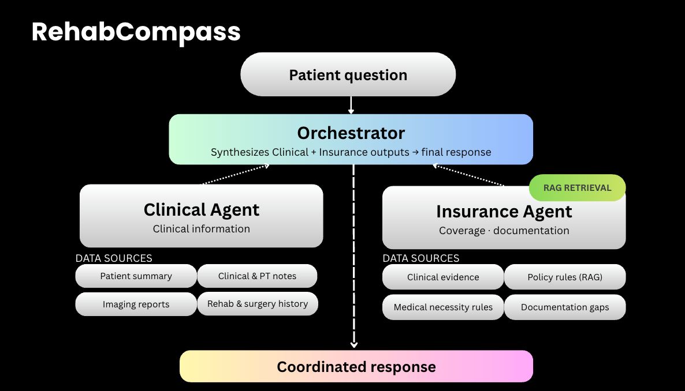

# RehabCompass Agent

RehabCompass is an A2A-compatible clinical and insurance reasoning agent for post-operative rehabilitation planning. The current demo answers physical therapy eligibility questions for a fixed ACL reconstruction case by combining clinical reasoning, Kaiser policy retrieval, benefit-limit checks, and a Prompt Opinion-facing response adapter.

The system is built for decision support and care coordination demos. It does not make coverage determinations, submit authorizations, or replace clinician or insurer review.

## What It Does

Given a user question such as:

```text
Is Daniel eligible for additional 2x/week PT under his Kaiser plan?
```

the agent returns a structured A2A task containing:

| Output | Purpose |
|---|---|
| Direct answer | Conditional eligibility and the main reason |
| Clinical assessment | Whether the case supports additional supervised PT |
| Insurance assessment | Covered benefit, visit limit, network requirement, and documentation blockers |
| Decision logic | Clinical, insurance, and orchestrator reasoning with confidence levels |
| Next steps | Ordered actions needed before submission |

## Architecture



| Component | Role |
|---|---|
| Clinical Agent | Reads case notes, PT history, and imaging to assess clinical need |
| Insurance Agent | Retrieves Kaiser policy snippets and checks coverage/documentation requirements |
| Orchestrator | Combines clinical and insurance outputs into a single case resolution |
| Prompt Opinion Adapter | Exposes the workflow through A2A JSON-RPC endpoints |

The production path is:

```text
Prompt Opinion
  -> POST /a2a
  -> Orchestrator
  -> Clinical Agent
  -> Insurance Agent + policy retrieval
  -> Prompt Opinion-compatible task response
```

## Public Endpoints

When deployed, the service exposes:

| Endpoint | Method | Purpose |
|---|---:|---|
| `/health` | GET | Health check |
| `/.well-known/agent-card.json` | GET | A2A agent discovery card |
| `/a2a` | GET | Lightweight endpoint validation |
| `/a2a` | POST | A2A JSON-RPC invocation |
| `/demo-case` | GET | Demo case payload |
| `/run-case` | POST | Direct API invocation |
| `/run-case-debug` | POST | Internal debug packet |
| `/explore` | GET | Local browser demo |

## A2A Usage

Agent card:

```bash
curl https://3o30-rehabcompass-agent.hf.space/.well-known/agent-card.json
```

JSON-RPC invocation:

```bash
curl -X POST https://3o30-rehabcompass-agent.hf.space/a2a \
  -H "Content-Type: application/json" \
  -d '{
    "jsonrpc": "2.0",
    "id": "test-1",
    "method": "SendA2AMessage",
    "params": {
      "text": "Is Daniel eligible for 2x/week PT under his Kaiser plan?"
    }
  }'
```

Prompt Opinion should be connected using the agent card URL, not the Hugging Face repository URL:

```text
https://3o30-rehabcompass-agent.hf.space/.well-known/agent-card.json
```

## Running Locally

```bash
cd prototype
python -m venv .venv
source .venv/bin/activate
python -m pip install --upgrade pip
python -m pip install -r requirements.txt

export ANTHROPIC_API_KEY="your-anthropic-api-key"
export CLAUDE_MODEL="claude-opus-4-6"
export PUBLIC_BASE_URL="http://localhost:8000"

uvicorn src.hackathon_agent.app:app --reload --host 0.0.0.0 --port 8000
```

Then verify:

```bash
curl http://localhost:8000/health
python test_public_url.py http://localhost:8000 --with-case
```

## Hugging Face Spaces Deployment

This repository is configured as a Docker Space. Required Space variables:

| Variable | Required | Description |
|---|---:|---|
| `ANTHROPIC_API_KEY` | Yes | Anthropic API key used by the clinical, insurance, and summary agents |
| `CLAUDE_MODEL` | No | Claude model name. Defaults to `claude-opus-4-6` |
| `PUBLIC_BASE_URL` | Yes for public deployments | Public HTTPS base URL used in the agent card |

For the current Space:

```text
PUBLIC_BASE_URL=https://3o30-rehabcompass-agent.hf.space
```

Hugging Face rebuilds the Docker image automatically after each push.

## Repository Layout

```text
.
├── Dockerfile
├── README.md
├── prototype/
│   ├── requirements.txt
│   ├── src/hackathon_agent/
│   │   ├── app.py
│   │   ├── a2a.py
│   │   ├── orchestrator.py
│   │   ├── clinical_llm_agent.py
│   │   ├── insurance_llm_agent.py
│   │   ├── insurance_retriever.py
│   │   └── schemas.py
│   ├── test_public_url.py
│   ├── test_a2a_integration.py
│   └── data/
│       └── policy_snippets/
```

## Development Notes

- The demo uses a fixed synthetic patient case and fixed Kaiser plan details.
- Policy snippets are local text chunks used for retrieval during the insurance step.
- The public A2A response is intentionally concise: Prompt Opinion should receive the agent answer without duplicated artifact output.
- `run-case-debug` is intended for development and exposes internal intermediate packets.

## Safety

RehabCompass is for hackathon demonstration and decision support. It does not provide medical advice, guarantee coverage, or replace professional review by clinicians, insurers, or care coordinators.
