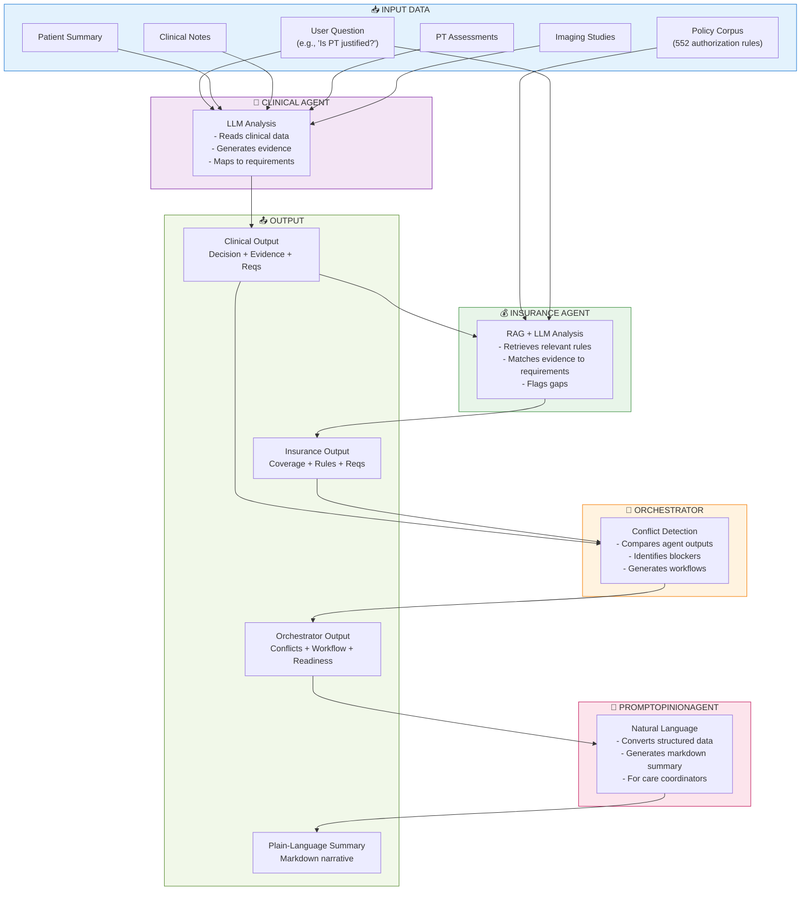

# RecoveryIQ — System Architecture & Data Flow Chart

## High-Level System Overview



---

## Detailed Agent Input/Output Specification

### **🏥 CLINICAL AGENT**

```
┌─────────────────────────────────────────────────────────────┐
│                   CLINICAL AGENT                            │
├─────────────────────────────────────────────────────────────┤
│                                                              │
│  INPUTS:                                                    │
│  ├─ Patient Summary (text)                                 │
│  │  └─ Demographics, medical history, current condition    │
│  ├─ Clinical Notes (text[])                                │
│  │  └─ Physician observations, exam findings, diagnoses    │
│  ├─ PT Assessments (text[])                                │
│  │  └─ Physical therapist evaluations, progress notes      │
│  ├─ Imaging Studies (text[])                               │
│  │  └─ MRI/X-ray reports, findings, measurements           │
│  └─ User Question (text)                                   │
│     └─ e.g., "Is additional PT justified?"                │
│                                                              │
│  PROCESS:                                                   │
│  └─ LLM (Google Gemini) analyzes clinical evidence          │
│     1. Reads all clinical data                              │
│     2. Extracts relevant findings                           │
│     3. Generates evidence statements                        │
│     4. Assigns strength (STRONG/MODERATE/WEAK)             │
│     5. Maps to clinical requirements                        │
│     6. Identifies clinical risk factors                     │
│                                                              │
│  OUTPUTS:                                                   │
│  ├─ decision.recommended_path                              │
│  │  └─ ADDITIONAL_PT / SURGICAL_REEVALUATION /             │
│  │     CONSERVATIVE_CARE / etc.                            │
│  ├─ confidence                                              │
│  │  └─ HIGH / MEDIUM / LOW                                 │
│  ├─ evidence[]                                              │
│  │  └─ Each: statement, strength, source_ref,              │
│  │     supports: "what_requirement"                        │
│  ├─ requirements[] (satisfied/unsatisfied/unknown)          │
│  │  └─ Objective measurements, structured PT plan, etc.    │
│  ├─ recommendation_reason_codes[]                          │
│  │  └─ Code labels explaining decision                     │
│  └─ risk_factors[]                                          │
│     └─ Fear of reinjury, cartilage degeneration, etc.      │
│                                                              │
└─────────────────────────────────────────────────────────────┘
```

---

### **💰 INSURANCE AGENT**

```
┌─────────────────────────────────────────────────────────────┐
│                   INSURANCE AGENT                           │
├─────────────────────────────────────────────────────────────┤
│                                                              │
│  INPUTS:                                                    │
│  ├─ Clinical Agent Output                                  │
│  │  ├─ decision (recommended path)                         │
│  │  ├─ evidence[] (with source refs and strength)          │
│  │  └─ requirements[] (satisfied/unsatisfied)              │
│  ├─ Policy Corpus (552 authorization rules)                │
│  │  ├─ Retrieved via Hybrid RAG:                           │
│  │  │  ├─ 0.2 × Embedding similarity (sentence-transformers)
│  │  │  ├─ 0.8 × Keyword matching (PT-specific phrases)     │
│  │  │  └─ Boost factors for relevant rules                 │
│  │  └─ Rule format: condition → coverage decision          │
│  ├─ User Question (text)                                   │
│  │  └─ Context for policy matching                         │
│  └─ Clinical Question Context                              │
│     └─ What clinical pathway is being evaluated            │
│                                                              │
│  PROCESS:                                                   │
│  └─ RAG + LLM (Google Gemini) matches evidence to policy   │
│     1. Retrieve relevant authorization rules (hybrid)       │
│     2. Read clinical evidence statements                    │
│     3. Check if evidence satisfies each rule               │
│     4. Mark rule as: ✅ SATISFIED / ❌ UNSATISFIED /        │
│        ❓ UNKNOWN                                           │
│     5. Identify documentation gaps                          │
│     6. Assess approval likelihood and appeal risks          │
│                                                              │
│  OUTPUTS:                                                   │
│  ├─ decision.coverage_position                             │
│  │  └─ LIKELY_COVERED / CONDITIONALLY_COVERED /            │
│  │     LIKELY_DENIED                                       │
│  ├─ confidence                                              │
│  │  └─ HIGH / MEDIUM / LOW                                 │
│  ├─ coverage_rules[]                                        │
│  │  ├─ rule_text (the policy requirement)                  │
│  │  ├─ satisfied_by (clinical evidence supporting it)      │
│  │  └─ unsatisfied_reason (gap if not met)                 │
│  ├─ requirements[] (objective measurements, etc.)           │
│  │  └─ Insurance documentation needs                       │
│  ├─ appeal_risk_factors[]                                  │
│  │  └─ What could make case fail on appeal                 │
│  └─ validation_errors[] (if fallback mode)                 │
│     └─ Errors from LLM retries                             │
│                                                              │
└─────────────────────────────────────────────────────────────┘
```

---

### **🤖 ORCHESTRATOR**

```
┌─────────────────────────────────────────────────────────────┐
│                   ORCHESTRATOR                              │
├─────────────────────────────────────────────────────────────┤
│                                                              │
│  INPUTS:                                                    │
│  ├─ Clinical Agent Output                                  │
│  │  ├─ decision + confidence                               │
│  │  ├─ evidence[] with sources                             │
│  │  └─ requirements[] status                               │
│  ├─ Insurance Agent Output                                 │
│  │  ├─ coverage_position + confidence                      │
│  │  ├─ coverage_rules[] with satisfaction status           │
│  │  └─ requirements[] and appeal risks                     │
│  ├─ User Question (context)                                │
│  └─ Case Data (for reference)                              │
│                                                              │
│  PROCESS:                                                   │
│  └─ Rule-based conflict detection & resolution             │
│     1. Compare clinical decision vs insurance position     │
│     2. Identify where agents AGREE / DISAGREE              │
│     3. Flag BLOCKING conflicts (prevent approval)          │
│     4. Flag INFORMATIONAL conflicts (noted only)           │
│     5. Assess overall case readiness:                      │
│        ├─ ✅ READY (no blockers, all requirements met)    │
│        ├─ 🟡 PENDING_DOCUMENTATION (missing docs)         │
│        ├─ 🟠 NEED_MORE_INFO (gaps in data)                │
│        └─ 🔴 BLOCKED (cannot proceed)                     │
│     6. Generate numbered workflow steps                     │
│     7. Identify blocking requirements                       │
│     8. Determine if human review needed                     │
│     9. List open questions                                  │
│                                                              │
│  OUTPUTS:                                                   │
│  ├─ conflict_items[]                                        │
│  │  ├─ conflict_type (CLINICAL_INSURANCE_MISMATCH, etc.)   │
│  │  ├─ between (which agents involved)                     │
│  │  ├─ reason (why they disagree)                          │
│  │  └─ blocking (TRUE/FALSE)                               │
│  ├─ case_resolution                                        │
│  │  ├─ readiness (READY / PENDING / NEED_MORE / BLOCKED)   │
│  │  ├─ requires_human_review (boolean)                     │
│  │  └─ recommended_path (action to take)                   │
│  ├─ recommended_workflow[]                                 │
│  │  ├─ step_N (numbered action)                            │
│  │  ├─ owner (CLINICAL / INSURANCE / HUMAN)                │
│  │  ├─ action (what to do)                                 │
│  │  ├─ done_definition (success criteria)                  │
│  │  └─ depends_on (dependencies on other steps)            │
│  ├─ blocking_requirements[]                                │
│  │  └─ Must-do items that block approval                   │
│  ├─ open_questions[]                                        │
│  │  └─ Unknowns that affect decision                       │
│  └─ escalation_reason (if case needs escalation)           │
│                                                              │
└─────────────────────────────────────────────────────────────┘
```

---

### **📝 PROMPTOPINIONAGENT**

```
┌─────────────────────────────────────────────────────────────┐
│               PROMPTOPINIONAGENT                            │
├─────────────────────────────────────────────────────────────┤
│                                                              │
│  INPUTS:                                                    │
│  ├─ Clinical Agent Output (structured)                     │
│  │  └─ Full clinical analysis                              │
│  ├─ Insurance Agent Output (structured)                    │
│  │  └─ Full insurance analysis                             │
│  ├─ Orchestrator Output (structured)                       │
│  │  └─ Conflicts, workflows, readiness                     │
│  └─ Original Case Data (for context)                       │
│                                                              │
│  PROCESS:                                                   │
│  └─ LLM (Google Gemini) generates natural language summary │
│     1. Read all structured agent outputs                    │
│     2. Understand key decision points                       │
│     3. Identify conflicts and agreements                    │
│     4. Extract action items from workflow                  │
│     5. Generate markdown narrative explaining:             │
│        ├─ Clinical position & evidence strength            │
│        ├─ Insurance position & coverage barriers           │
│        ├─ Why they agree/disagree                          │
│        ├─ What's blocking approval (if anything)           │
│        └─ Clear next steps for care coordinators           │
│                                                              │
│  OUTPUTS:                                                   │
│  └─ plain_language_opinion (markdown)                      │
│     ├─ **CLINICAL SUMMARY** section                        │
│     │  └─ What clinical evidence shows                     │
│     ├─ **INSURANCE SUMMARY** section                       │
│     │  └─ What insurance requires                          │
│     ├─ **ORCHESTRATOR RESOLUTION** section                 │
│     │  └─ How conflict is resolved                         │
│     ├─ **NEXT STEPS** section                              │
│     │  └─ Clear action items with owners                   │
│     └─ **OPEN QUESTIONS** section (optional)               │
│        └─ Unknowns that affect decision                    │
│                                                              │
│  USE CASE:                                                  │
│  └─ Care coordinators read this plain-language summary     │
│     to understand authorization status without reading     │
│     all structured JSON                                    │
│                                                              │
└─────────────────────────────────────────────────────────────┘
```

---

## Data Flow: Start to Finish

```
START: User asks question
│
├─→ Load Case Data
│   ├─ patient_summary.txt
│   ├─ clinical_notes[] (3-5 notes)
│   ├─ pt_notes[] (2-4 assessments)
│   └─ imaging[] (1-3 studies)
│
├─→ CLINICAL AGENT processes independently
│   ├─ LLM reads: patient summary + clinical + PT + imaging + question
│   ├─ LLM analyzes what clinical evidence supports
│   └─ Outputs: decision (ADDITIONAL_PT) + confidence (HIGH) + evidence[5] + requirements[3]
│
├─→ INSURANCE AGENT processes independently (but uses clinical output)
│   ├─ RAG retrieves relevant coverage rules
│   ├─ LLM reads: clinical_output + policy_rules + question
│   ├─ LLM checks: does clinical evidence satisfy insurance requirements?
│   └─ Outputs: coverage_position (CONDITIONAL) + rules_matched[4] + requirements[3]
│
├─→ ORCHESTRATOR compares both outputs
│   ├─ Are they recommending the same thing? → Clinical: YES, Insurance: MAYBE
│   ├─ Are there gaps? → Insurance needs objective measurements
│   ├─ Is this blocking? → YES, need documentation
│   ├─ What needs to happen next? → Collect measurements, submit, review
│   └─ Outputs: conflicts[1] + readiness (PENDING_DOCUMENTATION) + workflow[4] + blocking_reqs[2]
│
├─→ PROMPTOPINIONAGENT creates narrative
│   ├─ Reads all structured outputs
│   ├─ LLM generates markdown summary explaining:
│   │  - Clinical says: patient needs PT (strong evidence)
│   │  - Insurance says: maybe, but needs objective proof
│   │  - Orchestrator says: collect measurements, resubmit
│   └─ Outputs: plain_language_opinion (markdown)
│
└─→ DONE: System ready to respond to user or external system
   ├─ Web Explorer: displays all details + evidence drawer
   ├─ Desktop GUI: shows 3-panel flow
   ├─ Test Script: prints formatted output
   └─ A2A API: returns JSON with both structured + narrative

TIME: ~45-60 seconds total (includes LLM latency)
```

---

## Input Dependency Matrix

```
                  Clinical  Insurance  Orchestrator  Opinion
                  ────────  ────────  ────────────  ──────
Patient Summary      ✓          ✗           ✗         ✗
Clinical Notes       ✓          ✗           ✗         ✗
PT Assessments       ✓          ✗           ✗         ✗
Imaging Studies      ✓          ✗           ✗         ✗
User Question        ✓          ✓           ✓         ✗
Policy Corpus        ✗          ✓           ✗         ✗
Clinical Output      ✗          ✓           ✓         ✓
Insurance Output     ✗          ✗           ✓         ✓
Orchestrator Output  ✗          ✗           ✗         ✓

Legend:
✓ = Agent uses this input
✗ = Agent does not use this input
```

---

## Example: PT Authorization Case

### Input Data
```
CASE: Daniel Lee (patient)
QUESTION: "Is Daniel eligible for additional supervised PT?"

Clinical Data:
├─ Patient Summary: 32yo male, ACL revision 3 months ago
├─ Clinical Notes:
│  ├─ Note 1: "Exam shows mild laxity, quadriceps weakness"
│  ├─ Note 2: "Fear of reinjury limiting weight bearing"
│  └─ Note 3: "No acute tear on imaging"
├─ PT Notes:
│  ├─ Assess 1: "Started on supervised program 2 months ago"
│  └─ Assess 2: "Weakness improving but still significant"
└─ Imaging:
   ├─ MRI: "ACL graft intact, mild effusion"
   └─ X-ray: "No fracture or foreign bodies"

Insurance Policy Corpus:
├─ Rule 1: "Physician justification required" [SATISFIED by note 1]
├─ Rule 2: "Objective deficit required" [UNSATISFIED - no measurements]
├─ Rule 3: "Therapy plan required" [SATISFIED by PT notes]
└─ Rule 4: "24-visit limit per calendar year" [CHECKING]
```

### Agent Processing

**Clinical Agent:**
```
Analysis:
  ✓ Post-revision rehab incomplete (weakness persists)
  ✓ Documented quadriceps weakness on exam
  ✓ ACL graft stable (imaging shows intact)
  ✓ Active PT showing improvement
  
Decision: ADDITIONAL_PT (HIGH confidence)
Evidence:
  - "Quadriceps weakness on exam" [STRONG] → clinical_notes[0]
  - "Graft intact, no re-tear risk" [STRONG] → imaging[0]
  - "Improving on current program" [MODERATE] → pt_notes[1]
```

**Insurance Agent:**
```
Analysis:
  ✓ Rule 1: Physician justification → SATISFIED (note shows clinical reason)
  ✗ Rule 2: Objective deficit → UNSATISFIED (need strength testing numbers)
  ✓ Rule 3: Therapy plan → SATISFIED (PT notes detail plan)
  ? Rule 4: Visit limit → need authorization level info
  
Decision: CONDITIONALLY_COVERED (HIGH confidence)
Gap: Missing objective strength measurements for full approval
```

**Orchestrator:**
```
Conflict:
  Clinical: "PT is necessary" (HIGH confidence, strong evidence)
  Insurance: "PT is likely covered, but documentation is weak" (HIGH confidence)
  
Resolution:
  Type: CLINICAL_INSURANCE_MISMATCH [BLOCKING]
  Reason: Clinical recommends PT, but insurance approval conditional on stronger documentation
  
Readiness: 🟡 PENDING_DOCUMENTATION
Workflow:
  1. [CLINICAL] Obtain physician justification letter
  2. [INSURANCE] Request objective strength measurements
  3. [HUMAN] Review documentation and resubmit
```

**PromptOpinionAgent:**
```
Summary (plain language):

## Clinical Assessment
Daniel shows clear clinical need for continued supervised PT. Exam documents 
quadriceps weakness, ACL graft is stable on imaging, and progress is evident 
from current therapy. Strong clinical case.

## Insurance Status
Insurance policy requires three elements for approval:
- ✅ Physician justification: Present in clinical notes
- ❌ Objective measurements: MISSING (need strength testing data)
- ✅ Therapy plan: Clearly documented in PT assessments

## Next Steps
1. Obtain objective strength testing (e.g., manual muscle strength test)
2. Request physician letter explaining rationale for continued PT
3. Resubmit authorization with complete documentation

Current Status: PENDING DOCUMENTATION — not blocked, but needs action
```

---

## System Summary

| Aspect | Details |
|--------|---------|
| **Total Agents** | 4 (Clinical, Insurance, Orchestrator, PromptOpinionAgent) |
| **Independent Thinking** | Clinical + Insurance analyze separately; Orchestrator compares |
| **Data Flow** | Linear pipeline with feedback (Insurance uses Clinical output) |
| **Conflict Detection** | Rule-based, rule-based (not ML) |
| **Average Runtime** | 45-60 seconds (first run) |
| **Traceable Evidence** | ✅ 100% sourced (no hallucinations) |
| **Human-in-the-Loop** | ✅ Escalation when BLOCKED or requires human review |

